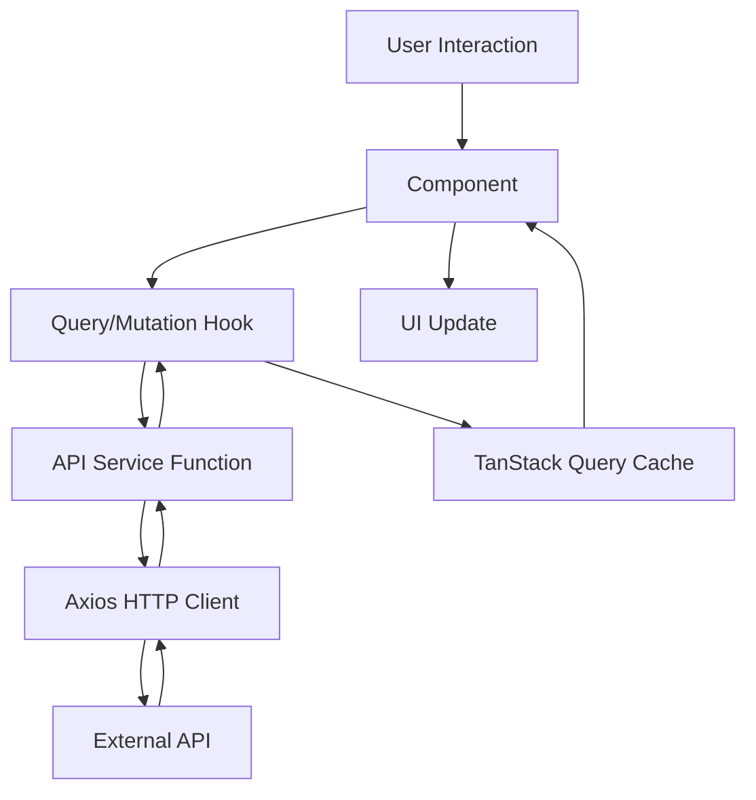

# Architecture Documentation

This document provides detailed technical documentation for the React Firebase Boilerplate, including architectural patterns, design decisions, and development best practices.

> 📖 **Quick Start**: See [README.md](./README.md) for installation and basic usage instructions.

## 🏗️ Architecture Overview

The boilerplate follows a **layered architecture** with clear separation of concerns:

```
src/
├── api/                    # Data Layer
│   ├── contracts/         # TypeScript contracts (requests/responses)
│   ├── mutations/         # TanStack Query mutations (POST/PUT/DELETE)
│   ├── queries/           # TanStack Query queries (GET)
│   ├── api-paths.ts       # Centralized API endpoint definitions
│   ├── api-service.ts     # HTTP client service layer
│   ├── auth-api.ts        # Firebase auth integration
│   ├── axios-configuration.ts # HTTP client configuration
│   ├── firebase.ts        # Firebase SDK configuration
│   ├── query-client.ts    # TanStack Query client setup
│   └── query-keys.ts      # Query key constants
├── components/            # Presentation Layer
│   ├── app-layout/        # Application shell components
│   ├── app-sidebar/       # Navigation components
│   ├── forms/             # Form components with validation
│   └── ui/                # Reusable UI primitives (Shadcn)
├── hooks/                 # Logic Layer
│   ├── use-handle-mutation-result.ts # Mutation result handling
│   └── use-mobile.ts      # Responsive utilities
├── pages/                 # Page Layer
│   ├── auth/              # Authentication pages
│   └── personal-information/ # Feature pages
├── providers/             # Context Layer
│   ├── auth-provider/     # Authentication state management
│   └── theme-provider/    # Theme management
├── router/                # Routing Layer
│   ├── app-routes.tsx     # Route definitions
│   ├── constants/routes.ts # Route constants
│   └── types/             # Routing type definitions
└── lib/                   # Utility Layer
    └── utils.ts           # Shared utility functions
```

## 🔄 Data Flow Architecture

### Request/Response Flow



### Detailed Flow Example

```typescript
// 1. User submits form
const onSubmit = (data: FormData) => mutation.mutate(data);

// 2. Mutation hook handles the request
const mutation = usePutPersonalInformationMutation({
  onSuccess: () => toast.success("Saved successfully!"),
  onError: (error) => toast.error(error.message),
});

// 3. API service makes HTTP request
const putPersonalInformation = async (data: PutPersonalInformationRequest) => {
  const response = await axiosInstance.put<PersonalInformationDto>(
    API_PATHS.PERSONAL_INFORMATION,
    data
  );
  return response.data;
};

// 4. TanStack Query manages cache invalidation
onSuccess: () => {
  queryClient.invalidateQueries([QUERY_KEYS.PERSONAL_INFO]);
};
```

## 🏛️ Architectural Patterns

### 1. API Layer Pattern

#### Centralized API Configuration

```typescript
// src/api/api-paths.ts - Single source of truth for endpoints
export const API_PATHS = {
  BASE: "/api",
  EXAMPLE_RESOURCE: "/api/example-resource",
  PERSONAL_INFORMATION: "/api/personal-information",
} as const;

// src/api/query-keys.ts - Centralized cache keys
export const QUERY_KEYS = {
  EXAMPLE_RESOURCE: "example-resource",
  PERSONAL_INFO: "personal-info",
} as const;
```

#### Type-Safe Contracts

```typescript
// Request contracts: src/api/contracts/requests/
export interface PutPersonalInformationRequest {
  name: string;
  email: string;
  jobTitle?: string;
  linkedin?: string;
  github?: string;
  twitter?: string;
}

// Response contracts: src/api/contracts/responses/
export interface PersonalInformationDto {
  id: string;
  name: string;
  email: string;
  jobTitle?: string;
  linkedin?: string;
  github?: string;
  twitter?: string;
  createdAt: string;
  updatedAt: string;
}
```

#### Service Layer Implementation

```typescript
// src/api/api-service.ts
export const apiService = {
  // GET operations
  getPersonalInformation: async (): Promise<PersonalInformationDto> => {
    const response = await axiosInstance.get<PersonalInformationDto>(
      API_PATHS.PERSONAL_INFORMATION
    );
    return response.data;
  },

  // PUT operations
  putPersonalInformation: async (
    data: PutPersonalInformationRequest
  ): Promise<PersonalInformationDto> => {
    const response = await axiosInstance.put<PersonalInformationDto>(
      API_PATHS.PERSONAL_INFORMATION,
      data
    );
    return response.data;
  },
};
```

#### Query & Mutation Hooks

```typescript
// src/api/queries/use-get-personal-information-query.ts
export const useGetPersonalInformationQuery = () => {
  return useQuery({
    queryKey: [QUERY_KEYS.PERSONAL_INFO],
    queryFn: apiService.getPersonalInformation,
    staleTime: 5 * 60 * 1000, // 5 minutes
  });
};

// src/api/mutations/use-put-personal-information-mutation.ts
export const usePutPersonalInformationMutation = (
  options?: CustomMutationOptions<
    PersonalInformationDto,
    Error,
    PutPersonalInformationRequest
  >
) => {
  return useMutation<
    PersonalInformationDto,
    Error,
    PutPersonalInformationRequest
  >({
    mutationFn: apiService.putPersonalInformation,
    onSuccess: (data) => {
      // Optimistically update cache
      queryClient.setQueryData([QUERY_KEYS.PERSONAL_INFO], data);
    },
    ...options,
  });
};
```

### 2. Authentication Architecture

#### Firebase Integration

```typescript
// src/api/firebase.ts
import { initializeApp } from "firebase/app";
import { getAuth } from "firebase/auth";

const firebaseConfig = {
  apiKey: import.meta.env.VITE_FIREBASE_API_KEY,
  authDomain: import.meta.env.VITE_FIREBASE_AUTH_DOMAIN,
  // ... other config
};

export const app = initializeApp(firebaseConfig);
export const auth = getAuth(app);
```

#### Auth Context Pattern

```typescript
// src/providers/auth-provider/context.ts
export interface AuthContextType {
  firebaseUser: User | null;
  isLoading: boolean;
  googleLogin: () => Promise<void>;
  logout: () => Promise<void>;
}

// src/providers/auth-provider/provider.tsx
export const AuthProvider: React.FC<{ children: React.ReactNode }> = ({
  children,
}) => {
  const [firebaseUser, setFirebaseUser] = useState<User | null>(null);
  const [isLoading, setIsLoading] = useState(true);

  useEffect(() => {
    const unsubscribe = onAuthStateChanged(auth, (user) => {
      setFirebaseUser(user);
      setIsLoading(false);
    });
    return unsubscribe;
  }, []);

  const googleLogin = async () => {
    const provider = new GoogleAuthProvider();
    await signInWithPopup(auth, provider);
  };

  const logout = async () => {
    await signOut(auth);
  };

  return (
    <AuthContext.Provider
      value={{ firebaseUser, isLoading, googleLogin, logout }}
    >
      {children}
    </AuthContext.Provider>
  );
};
```

#### Route Protection Pattern

```typescript
// src/router/app-routes.tsx
const ProtectedRoute: React.FC<{ children: React.ReactNode }> = ({
  children,
}) => {
  const { firebaseUser, isLoading } = useAuthContext();
  const location = useLocation();

  if (isLoading) return null; // Loading state

  if (!firebaseUser) {
    return <Navigate to="/auth" state={{ from: location }} replace />;
  }

  return <>{children}</>;
};
```

### 3. Component Architecture Patterns

#### Component Hierarchy

```
App
├── Providers (Auth, Theme, Query)
├── AppLayout
│   ├── AppSidebar
│   │   ├── NavUser
│   │   └── NavMain
│   ├── AppBreadcrumbs
│   └── Page Content
└── Routes
```

#### Form Component Pattern

```typescript
// src/components/forms/personal-info-form/personal-info-form.tsx
export function PersonalInformationForm() {
  // 1. Form setup with validation
  const form = useForm<FormData>({
    resolver: zodResolver(formSchema),
    defaultValues: {
      /* ... */
    },
  });

  // 2. Mutation hook with error handling
  const { mutate, isPending, error } = usePutPersonalInformationMutation({
    onSuccess: () => toast.success("Saved successfully!"),
    onError: (error) => toast.error(error.message),
  });

  // 3. Submit handler
  const onSubmit = (data: FormData) => mutate(data);

  // 4. Render with proper loading states
  return (
    <Form {...form}>
      <form onSubmit={form.handleSubmit(onSubmit)}>
        {/* Form fields */}
        <Button type="submit" disabled={isPending}>
          {isPending ? "Saving..." : "Save"}
        </Button>
      </form>
    </Form>
  );
}
```

### 4. State Management Strategy

#### Server State (TanStack Query)

- **Purpose**: API data, caching, synchronization
- **Usage**: All data fetched from external APIs
- **Benefits**: Automatic caching, background refetching, optimistic updates

#### Client State (React State)

- **Purpose**: UI state, form state, component-local state
- **Usage**: Modal open/close, form inputs, loading states
- **Implementation**: `useState`, `useReducer` for complex state

#### Global State (Context API)

- **Purpose**: App-wide state that needs to be shared
- **Usage**: Authentication, theme, user preferences
- **Benefits**: Avoids prop drilling, type-safe with TypeScript

```typescript
// Example: Theme management
const ThemeProvider: React.FC<{ children: React.ReactNode }> = ({
  children,
}) => {
  const [theme, setTheme] = useState<"dark" | "light" | "system">("system");

  useEffect(() => {
    const root = window.document.documentElement;
    root.classList.remove("light", "dark");

    if (theme === "system") {
      const systemTheme = window.matchMedia("(prefers-color-scheme: dark)")
        .matches
        ? "dark"
        : "light";
      root.classList.add(systemTheme);
    } else {
      root.classList.add(theme);
    }
  }, [theme]);

  return (
    <ThemeContext.Provider value={{ theme, setTheme }}>
      {children}
    </ThemeContext.Provider>
  );
};
```

## 🎨 Styling Architecture

### CSS-in-JS Strategy

```typescript
// Using CVA (Class Variance Authority) for component variants
const buttonVariants = cva(
  "inline-flex items-center justify-center rounded-md text-sm font-medium transition-colors",
  {
    variants: {
      variant: {
        default: "bg-primary text-primary-foreground hover:bg-primary/90",
        destructive:
          "bg-destructive text-destructive-foreground hover:bg-destructive/90",
        outline:
          "border border-input bg-background hover:bg-accent hover:text-accent-foreground",
      },
      size: {
        default: "h-10 px-4 py-2",
        sm: "h-9 rounded-md px-3",
        lg: "h-11 rounded-md px-8",
      },
    },
    defaultVariants: {
      variant: "default",
      size: "default",
    },
  }
);
```

### Theme System

```css
/* CSS Variables for theming in index.css */
:root {
  --background: 0 0% 100%;
  --foreground: 222.2 84% 4.9%;
  --primary: 222.2 47.4% 11.2%;
  --primary-foreground: 210 40% 98%;
}

.dark {
  --background: 222.2 84% 4.9%;
  --foreground: 210 40% 98%;
  --primary: 210 40% 98%;
  --primary-foreground: 222.2 47.4% 11.2%;
}
```

## 🧪 Testing Strategy

### Testing Framework: Vitest

The boilerplate uses **Vitest** as the primary testing framework, providing:

- ⚡ **Fast execution** - Native ESM support and hot module replacement
- 🔧 **Vite integration** - Same configuration as your build tool
- 🧪 **Jest compatibility** - Drop-in replacement for Jest APIs
- 📊 **Built-in coverage** - Code coverage reports without additional setup
- 🔍 **TypeScript support** - First-class TypeScript integration

### Component Testing

```typescript
// Example: Testing a form component
import { render, screen, fireEvent, waitFor } from "@testing-library/react";
import { vi } from "vitest";
import { PersonalInformationForm } from "./personal-info-form";

test("submits form with valid data", async () => {
  const mockMutate = vi.fn();
  vi.mock("@/api/mutations/use-put-personal-information-mutation", () => ({
    usePutPersonalInformationMutation: () => ({
      mutate: mockMutate,
      isPending: false,
    }),
  }));

  render(<PersonalInformationForm />);

  fireEvent.change(screen.getByLabelText(/name/i), {
    target: { value: "John Doe" },
  });
  fireEvent.change(screen.getByLabelText(/email/i), {
    target: { value: "john@example.com" },
  });
  fireEvent.click(screen.getByRole("button", { name: /save/i }));

  await waitFor(() => {
    expect(mockMutate).toHaveBeenCalledWith({
      name: "John Doe",
      email: "john@example.com",
    });
  });
});
```

### Hook Testing

```typescript
// Example: Testing custom hooks
import { renderHook, act } from "@testing-library/react";
import { vi } from "vitest";
import { useHandleMutationResult } from "./use-handle-mutation-result";

test("shows success message and redirects", () => {
  const mockToast = vi.fn();
  const mockNavigate = vi.fn();

  // Mock dependencies
  vi.mock("sonner", () => ({ toast: { success: mockToast } }));
  vi.mock("react-router-dom", () => ({ useNavigate: () => mockNavigate }));

  const { result } = renderHook(() =>
    useHandleMutationResult({
      successMessage: "Success!",
      redirectPath: "/dashboard",
    })
  );

  act(() => {
    result.current.onSuccess();
  });

  expect(mockToast).toHaveBeenCalledWith("Success!");
  expect(mockNavigate).toHaveBeenCalledWith("/dashboard");
});
```

### API Testing with MSW

```typescript
// Example: Mocking API responses
import { http, HttpResponse } from "msw";
import { setupServer } from "msw/node";

const server = setupServer(
  http.put("/api/personal-information", async ({ request }) => {
    const body = await request.json();
    return HttpResponse.json({ id: "1", ...body });
  })
);

beforeAll(() => server.listen());
afterEach(() => server.resetHandlers());
afterAll(() => server.close());
```

### Test Setup Configuration

```typescript
// vitest.config.ts
import { defineConfig } from "vitest/config";
import react from "@vitejs/plugin-react";
import { resolve } from "path";

export default defineConfig({
  plugins: [react()],
  test: {
    globals: true,
    environment: "jsdom",
    setupFiles: ["./src/test/setup.ts"],
    css: true,
    coverage: {
      provider: "v8",
      reporter: ["text", "json", "html"],
      exclude: ["node_modules/", "src/test/", "**/*.d.ts", "**/*.config.*"],
    },
  },
  resolve: {
    alias: {
      "@": resolve(__dirname, "./src"),
    },
  },
});
```

```typescript
// src/test/setup.ts
import { vi } from "vitest";
import "@testing-library/jest-dom";

// Mock Firebase
vi.mock("@/api/firebase", () => ({
  auth: {},
  db: {},
}));

// Global test utilities
global.ResizeObserver = vi.fn().mockImplementation(() => ({
  observe: vi.fn(),
  unobserve: vi.fn(),
  disconnect: vi.fn(),
}));
```

### Testing Scripts

```json
// package.json
{
  "scripts": {
    "test": "vitest",
    "test:ui": "vitest --ui",
    "test:run": "vitest run",
    "test:coverage": "vitest run --coverage"
  }
}
```

## 📋 Development Guidelines

### File Naming Conventions

| Type                 | Convention                         | Example                       |
| -------------------- | ---------------------------------- | ----------------------------- |
| **Components**       | PascalCase                         | `PersonalInformationForm.tsx` |
| **Hooks**            | camelCase with `use` prefix        | `useAuthContext.ts`           |
| **Types/Interfaces** | PascalCase with descriptive suffix | `PersonalInformationDto.ts`   |
| **Constants**        | SCREAMING_SNAKE_CASE               | `API_PATHS`, `QUERY_KEYS`     |
| **Utilities**        | camelCase                          | `getBreadcrumbsFromPath.ts`   |
| **Directories**      | kebab-case                         | `personal-info-form/`         |

### Import Organization

```typescript
// 1. React imports
import { useState, useEffect } from "react";

// 2. Third-party library imports
import { useMutation } from "@tanstack/react-query";
import { zodResolver } from "@hookform/resolvers/zod";

// 3. Internal imports (absolute paths)
import { apiService } from "@/api/api-service";
import { Button } from "@/components/ui/button";
import { useAuthContext } from "@/providers/auth-provider/use-auth-context";

// 4. Relative imports
import "./component.css";
```

### Export Patterns

```typescript
// Named exports for utilities, hooks, types
export const useCustomHook = () => {};
export interface CustomType {}
export const CONSTANT_VALUE = "value";

// Default exports for main components/pages
export default function ComponentName() {}

// Preferred: Named exports for better tree-shaking
export const ComponentName = () => {};
```

### Error Handling Standards

```typescript
// API Error Handling
try {
  const result = await apiService.getData();
  return result;
} catch (error) {
  if (error instanceof AxiosError) {
    // Handle HTTP errors
    throw new Error(error.response?.data?.message || "Request failed");
  }
  // Handle unexpected errors
  throw new Error("An unexpected error occurred");
}

// Form Validation Errors
const formSchema = z.object({
  email: z.string().email("Please enter a valid email address"),
  name: z.string().min(1, "Name is required").max(100, "Name is too long"),
});
```

## 🚀 Development Workflow

### Adding New Features

#### 1. API Integration

```bash
# 1. Define API endpoint
src/api/api-paths.ts

# 2. Create TypeScript contracts
src/api/contracts/requests/NewRequest.ts
src/api/contracts/responses/NewResponse.ts

# 3. Add service method
src/api/api-service.ts

# 4. Create query/mutation hooks
src/api/queries/use-get-new-data-query.ts
src/api/mutations/use-post-new-data-mutation.ts

# 5. Update query keys
src/api/query-keys.ts
```

#### 2. Component Development

```bash
# 1. Create component
src/components/feature-name/component-name.tsx

# 2. Add to page if needed
src/pages/feature-name/feature-name.tsx

# 3. Configure routing
src/router/constants/routes.ts
src/router/app-routes.tsx
```

#### 3. Form Implementation

```typescript
// 1. Define validation schema
const formSchema = z.object({
  field: z.string().min(1, "Field is required"),
});

// 2. Setup form with react-hook-form
const form = useForm<z.infer<typeof formSchema>>({
  resolver: zodResolver(formSchema),
  defaultValues: { field: "" },
});

// 3. Create mutation hook
const mutation = usePostDataMutation({
  onSuccess: () => toast.success("Success!"),
  onError: (error) => toast.error(error.message),
});

// 4. Handle submission
const onSubmit = (data: z.infer<typeof formSchema>) => {
  mutation.mutate(data);
};
```

### Performance Optimization

#### Code Splitting

```typescript
// Lazy load pages
const PersonalInformationPage = lazy(
  () => import("@/pages/personal-information/personal-information")
);

// Use Suspense for loading states
<Suspense fallback={<div>Loading...</div>}>
  <PersonalInformationPage />
</Suspense>;
```

#### Query Optimization

```typescript
// Prefetch data
const queryClient = useQueryClient();
queryClient.prefetchQuery({
  queryKey: [QUERY_KEYS.PERSONAL_INFO],
  queryFn: apiService.getPersonalInformation,
});

// Background refetching
const { data } = useGetPersonalInformationQuery({
  staleTime: 5 * 60 * 1000, // 5 minutes
  refetchOnWindowFocus: false,
});
```

## 🔧 Build & Deployment Architecture

### Environment Configuration

```typescript
// Environment variables pattern
interface ImportMetaEnv {
  readonly VITE_FIREBASE_API_KEY: string;
  readonly VITE_FIREBASE_AUTH_DOMAIN: string;
  readonly VITE_FIREBASE_PROJECT_ID: string;
  // ... other Firebase config
}

// Usage with validation
const getFirebaseConfig = () => {
  const requiredEnvVars = [
    "VITE_FIREBASE_API_KEY",
    "VITE_FIREBASE_AUTH_DOMAIN",
    "VITE_FIREBASE_PROJECT_ID",
  ];

  for (const envVar of requiredEnvVars) {
    if (!import.meta.env[envVar]) {
      throw new Error(`Missing required environment variable: ${envVar}`);
    }
  }

  return {
    apiKey: import.meta.env.VITE_FIREBASE_API_KEY,
    authDomain: import.meta.env.VITE_FIREBASE_AUTH_DOMAIN,
    projectId: import.meta.env.VITE_FIREBASE_PROJECT_ID,
  };
};
```

### Production Build Optimization

```typescript
// vite.config.ts optimizations
export default defineConfig({
  build: {
    rollupOptions: {
      output: {
        manualChunks: {
          vendor: ["react", "react-dom"],
          firebase: ["firebase/app", "firebase/auth"],
          ui: ["@radix-ui/react-dialog", "@radix-ui/react-dropdown-menu"],
        },
      },
    },
    chunkSizeWarningLimit: 1000,
  },
});
```

## 🎯 Architecture Benefits

This architecture provides:

- **🔒 Type Safety**: Full TypeScript coverage with strict typing
- **🚀 Performance**: Code splitting, lazy loading, optimized builds
- **🧪 Testability**: Clean separation allows for easy unit/integration testing
- **📈 Scalability**: Feature-based organization scales with team size
- **🔧 Maintainability**: Clear patterns and conventions reduce cognitive load
- **🔄 Developer Experience**: Hot reloading, good tooling, clear error messages
- **🛡️ Security**: Authentication guards, environment variable validation
- **📱 Responsiveness**: Mobile-first design with responsive utilities

---

**🔗 Related Documentation**

- [README.md](./README.md) - Quick start and basic usage
- [Contributing Guidelines](./CONTRIBUTING.md) - How to contribute to the project
- [API Documentation](./docs/API.md) - Detailed API reference
